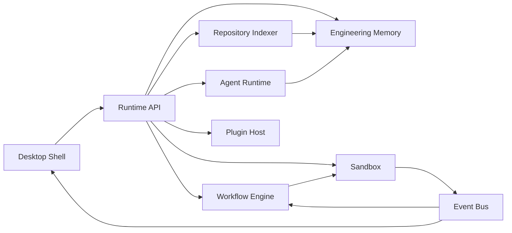

# Veltrix Architecture

## Layers

Veltrix is designed as a desktop application with an embedded local backend runtime.

## Desktop Layer

- Tauri shell
- Filesystem access
- Secure permission prompts
- Local runtime launch
- Terminal and sandbox bridge
- Web dashboard rendering

## Runtime Layer

- Runtime API
- Repository Intelligence Engine
- Multi-Agent Runtime
- Durable Workflow Engine
- Engineering Memory System
- Event Streaming System
- Sandbox Execution Recorder
- Plugin Host

## Data Layer

Current implementation:

- `.veltrix/runtime-db.json`

Production target:

- PostgreSQL for durable entities
- Redis Streams or NATS for events
- Qdrant for vector memory
- Local filesystem object storage for execution artifacts

## AI Layer

Production target:

- Ollama local models
- Qwen and DeepSeek coding models
- Local embedding models
- Agent tool registry
- Permission-scoped execution

## Service Map

